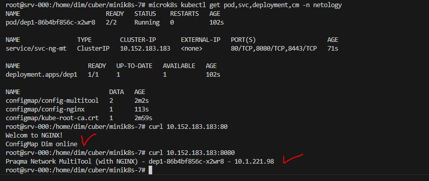
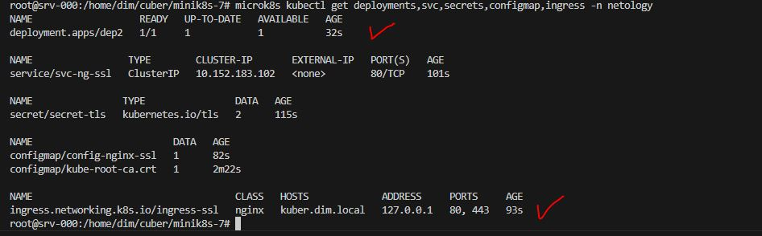
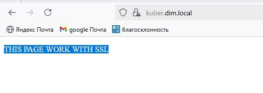
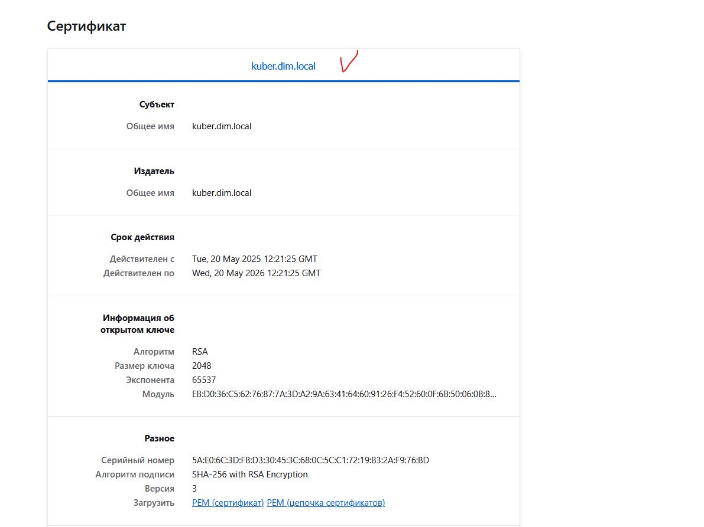

# Домашнее задание к занятию «Конфигурация приложений»

### Цель задания

------

### Чеклист готовности к домашнему заданию

1. Установленное K8s-решение (например, MicroK8s).
2. Установленный локальный kubectl.
3. Редактор YAML-файлов с подключённым GitHub-репозиторием.

------

### Инструменты и дополнительные материалы, которые пригодятся для выполнения задания

1. [Описание](https://kubernetes.io/docs/concepts/configuration/secret/) Secret.
2. [Описание](https://kubernetes.io/docs/concepts/configuration/configmap/) ConfigMap.
3. [Описание](https://github.com/wbitt/Network-MultiTool) Multitool.

------

### Задание 1. Создать Deployment приложения и решить возникшую проблему с помощью ConfigMap. Добавить веб-страницу

1. Создать Deployment приложения, состоящего из контейнеров nginx и multitool.
2. Решить возникшую проблему с помощью ConfigMap.
3. Продемонстрировать, что pod стартовал и оба конейнера работают.
4. Сделать простую веб-страницу и подключить её к Nginx с помощью ConfigMap. Подключить Service и показать вывод curl или в браузере.
5. Предоставить манифесты, а также скриншоты или вывод необходимых команд.

**Ответ.**

1. [deployment.yaml](deployment.yaml)
    <details><summary>deployment.yaml</summary>

    ```yaml
    ---
    apiVersion: apps/v1
    kind: Deployment
    metadata:
      name: dep1
      labels:
        task: one
        tier: homework
      annotations:
        container1: nginx
        container2: multitools
      namespace: netology
    spec:
      replicas: 1
      strategy:
        rollingUpdate:
        maxSurge: 1
        maxUnavailable: 1
        type: RollingUpdate
      selector:
        matchLabels:
          app: nginx-multitool
    template:
        metadata:
          labels:
            app: nginx-multitool
        spec:
          containers:
          - name: nginx
            image: nginx:1.24.0
            resources:
              limits:
                memory: "128Mi"
                cpu: "500m"
              requests:
                memory: "64Mi"
                cpu: "250m"
            ports:
              - name: nginx-web
                containerPort: 80
            livenessProbe:
                tcpSocket:
                port: 80
                initialDelaySeconds: 10
                timeoutSeconds: 3
            readinessProbe:
                httpGet:
                path: /
                port: 80
                initialDelaySeconds: 15
                timeoutSeconds: 5
                successThreshold: 1
                failureThreshold: 4
            volumeMounts:
              - name: nginx-page
                mountPath: "/usr/share/nginx/html"
          - name: multitool
            image: praqma/network-multitool:alpine-extra
            resources:
              limits:
                memory: "128Mi"
                cpu: "450m"
              requests:
                memory: "32Mi"
                cpu: "150m"
            env:
                - name: HTTP_PORT
                valueFrom:
                  configMapKeyRef:
                    name: config-multitool
                    key: http
                - name: HTTPS_PORT
                valueFrom:
                  configMapKeyRef:
                    name: config-multitool
                    key: https
            ports:
              - name: http
                containerPort: 8080
                protocol: TCP
              - name: https
                containerPort: 8443
                protocol: TCP
            livenessProbe:
              tcpSocket:
                port: 8080
              initialDelaySeconds: 10
              timeoutSeconds: 3
            readinessProbe:
              httpGet:
                path: /
                port: 8080
              initialDelaySeconds: 15
              timeoutSeconds: 5
              successThreshold: 1
              failureThreshold: 2
        volumes:
          - name:  nginx-page
            configMap:
              name: config-nginx
    ...
    ```
    </details>

2. [configmap-multitool.yaml](configmap-multitool.yaml)
    <details><summary>configmap-multitool.yaml</summary>

    ```yaml
    ---
    apiVersion: v1
    kind: ConfigMap
    metadata:
      name: config-multitool
      labels:
        app: multitool-ports
      namespace: netology
    data:
      http: "8080"
      https: "8443"
    ...
    ```
    </details>

3. 

4.  `configmap-nginx.yaml` и `service.yaml`
    - [configmap-nginx.yaml](configmap-nginx.yaml)
    <details><summary>configmap-nginx.yaml</summary>

    ```yaml
    ---
    apiVersion: v1
    kind: ConfigMap
    metadata:
      name: config-nginx
      labels:
        app: nginx-page
      namespace: netology
    data:
      index.html: |
        Welcom to NGINX!
        ConfigMap Dim on line
    ...
    ```
    </details>

    - [service.yaml](service.yaml)
    <details><summary>service.yaml</summary>

    ```yaml
    ---
    apiVersion: v1
    kind: Service
    metadata:
      name: svc-ng-mt
      namespace: netology
    spec:
      selector:
        app: nginx-multitool
      type: ClusterIP
      ports:
      - name: nginx-http
        port: 80
        targetPort: nginx-web
      - name: multitool-http
        port: 8080
        targetPort: http
      - name: multitool-https
        port: 8443
        targetPort: https
    ...
    ```
    </details>

    - 


------

### Задание 2. Создать приложение с вашей веб-страницей, доступной по HTTPS 

1. Создать Deployment приложения, состоящего из Nginx.
2. Создать собственную веб-страницу и подключить её как ConfigMap к приложению.
3. Выпустить самоподписной сертификат SSL. Создать Secret для использования сертификата.
4. Создать Ingress и необходимый Service, подключить к нему SSL в вид. Продемонстировать доступ к приложению по HTTPS. 
4. Предоставить манифесты, а также скриншоты или вывод необходимых команд.

**Ответ.**

1. [deployment2.yaml](deployment2.yaml)
    <details><summary>deployment2.yaml</summary>

    ```yaml
    ---
    apiVersion: apps/v1
    kind: Deployment
    metadata:
    name: dep2
    labels:
        task: two
        tier: homework
    annotations:
        container: nginx
    namespace: netology
    spec:
    replicas: 1
    strategy:
        rollingUpdate:
        maxSurge: 1
        maxUnavailable: 1
        type: RollingUpdate
    selector:
        matchLabels:
        app: nginx-ssl
    template:
        metadata:
        labels:
            app: nginx-ssl
        spec:
        containers:
            - name: nginx
            image: nginx:1.24.0
            resources:
                limits:
                memory: "128Mi"
                cpu: "500m"
                requests:
                memory: "64Mi"
                cpu: "250m"
            ports:
                - name: nginx-web
                containerPort: 80
            livenessProbe:
                tcpSocket:
                port: 80
                initialDelaySeconds: 10
                timeoutSeconds: 3
            readinessProbe:
                httpGet:
                path: /
                port: 80
                initialDelaySeconds: 15
                timeoutSeconds: 5
                successThreshold: 1
                failureThreshold: 4
            volumeMounts:
                - name: nginx-page
                mountPath: "/usr/share/nginx/html"
        volumes:
            - name:  nginx-page
            configMap:
                name: config-nginx-ssl
    ...
    ```
    </details>
2. [configmap2.yaml](configmap2.yaml)
    <details><summary>configmap2.yaml</summary>

    ```yaml
    ---
    apiVersion: v1
    kind: ConfigMap
    metadata:
      name: config-nginx-ssl
      labels:
        app: nginx-page
      namespace: netology
    data:
      index.html: |
        <!DOCTYPE html>
        <html>
            <head>
                <title>Welcom to Secure NGINX!</title>
            </head>
            <body>
                <p>THIS PAGE WORK WITH SSL</p>
            </body>
        </html>
    ...
    ```
    </details>
3. Сертификат:
- Создаем самоподписной сертификат:
```sh
openssl req -x509 -nodes -days 365 -newkey rsa:2048 -keyout tls.key -out tls.crt -subj "/CN=kuber.dim.local"
```
- Кодируем в `base64`:

```sh
cat tls.crt | base64
cat tls.key | base64
```
- [secret2.yaml](secret2.yaml)
    <details><summary>secret2.yaml</summary>

    ```yaml
    ---
    apiVersion: v1
    kind: Secret
    metadata:
      name: secret-tls
      namespace: netology
    type: kubernetes.io/tls
    data:
      tls.crt: 
      LS0tLS1CRUdJTiBDRVJUSUZJQ0FURS0tLS0tCk1JSURGVENDQWYyZ0F3SUJBZ0lVSDhyeXdBMDdR
      OCtkdVJsWTNlQXg4RWlUemQ4d0RRWUpLb1pJaHZjTkFRRUwKQlFBd0dqRVlNQllHQTFVRUF3d1Bh
      M1ZpWlhJdVpHbHRMbXh2WTJGc01CNFhEVEkxTURVeU1ERXdNelF6T1ZvWApEVEkyTURVeU1ERXdN
      elF6T1Zvd0dqRVlNQllHQTFVRUF3d1BhM1ZpWlhJdVpHbHRMbXh2WTJGc01JSUJJakFOCkJna3Fo
      a2lHOXcwQkFRRUZBQU9DQVE4QU1JSUJDZ0tDQVFFQXR3d1lKZ1NMYnJMYTZ4WDZOZ1FqZUdKdzc5
      M1cKNDlLelBwNzArbnZ0dFJMNU1NOVRSMkpNYWp3MGptT2FkT1lNMDVZWlZrR1NhSmRZRkhOeCty
      emlEOUlCSnBiOApuSUZjaHlMRnNTaFlPUHFJb2Y0Q1NZZnNoaUJXRldtazJNM1BldFdMSkE5eDI2
      VGtobE1PVys0bXJIdERUUGxZCnJUWWNXZVM5TzlMUG1yRklhZDJtR25zeGJJdEVTd1MwOVZnOXkv
      WlJoSEMwMmEzM2lhRFFOTjZEOEFTamlZeisKcjAvbVBtRlNIcWVCNkNkTy9jdGdveEwwcWNTQ2s3
      cWFzWFZSTDg4R2llNDlLRUV4Rnk1b0VmMHdOdENTMTBodAprTVZHTk1KTGtSKyt1MUg0cG5sdlJl
      RnhBUVVIdFlkcU1NU004UGRHR3RxM1VtOVNwTnZDaVYwRGNRSURBUUFCCm8xTXdVVEFkQmdOVkhR
      NEVGZ1FVMjJvWHpSS1EvM1dEaGJFa2tXL2hyb0J2QTg0d0h3WURWUjBqQkJnd0ZvQVUKMjJvWHpS
      S1EvM1dEaGJFa2tXL2hyb0J2QTg0d0R3WURWUjBUQVFIL0JBVXdBd0VCL3pBTkJna3Foa2lHOXcw
      QgpBUXNGQUFPQ0FRRUFnQVJlZTRkRTNiTXEvY3o2UTNQbmo5TjdpdGFCdXZwSVo3ckZPSlVndXZi
      aVdJaSsydEJ3CldFeVc0Y2FVbmpJTWhwd2t0ZjhacTlSaWVZUE5ycXhuM3oyZmZGcjNEWWg2VGhw
      em03b1M2dzVXRnVTUllXekYKV2pCMEZ0d29ZL2dpZmZXd2oyY0hNdll3SnhwQmZKTHROQjhNcE9t
      K0h3ZE9JTUZ6aDZsVEs4UHY1UldnNW9NdApWcTlYQVdGMGFkK2RER0FvVVFXNk1MU2hoaytrenhk
      Vnp4WTJub09OcnJmZEdGNWpKSVFXdnlEUERhaStiWjI1CnNPSy9NV1BxZ2hVdlcwY0htZ2tRZ3pu
      OXBPZ0NQa3VzTDRHb2JYSkFyYlZIUVoxUTlGRDd0d0xNOVJZQWY2NzEKRjNuVm01dWhWcXFneDQr
      MllJV0UvdS92YnRLREo3UTBSZz09Ci0tLS0tRU5EIENFUlRJRklDQVRFLS0tLS0K
      
      tls.key: 
      LS0tLS1CRUdJTiBQUklWQVRFIEtFWS0tLS0tCk1JSUV2UUlCQURBTkJna3Foa2lHOXcwQkFRRUZB
      QVNDQktjd2dnU2pBZ0VBQW9JQkFRQzNEQmdtQkl0dXN0cnIKRmZvMkJDTjRZbkR2M2RiajByTStu
      dlQ2ZSsyMUV2a3d6MU5IWWt4cVBEU09ZNXAwNWd6VGxobFdRWkpvbDFnVQpjM0g2dk9JUDBnRW1s
      dnljZ1Z5SElzV3hLRmc0K29paC9nSkpoK3lHSUZZVmFhVFl6Yzk2MVlza0QzSGJwT1NHClV3NWI3
      aWFzZTBOTStWaXROaHhaNUwwNzBzK2FzVWhwM2FZYWV6RnNpMFJMQkxUMVdEM0w5bEdFY0xUWnJm
      ZUoKb05BMDNvUHdCS09KalA2dlQrWStZVkllcDRIb0owNzl5MkNqRXZTcHhJS1R1cHF4ZFZFdnp3
      YUo3ajBvUVRFWApMbWdSL1RBMjBKTFhTRzJReFVZMHdrdVJINzY3VWZpbWVXOUY0WEVCQlFlMWgy
      b3d4SXp3OTBZYTJyZFNiMUtrCjI4S0pYUU54QWdNQkFBRUNnZ0VBTWI1MXFZOCtuUnk1NVgwWmZD
      aHZ3ejF0VjZJL3piWHF4Qy9LZjIvQ1Q1MFMKWHpOWWZHTzRSSDZNQWM0TG9ZMExHMDBGSWEyOExm
      UkRHWHV1RStmVXYxdmd1QzM4QkVRYmN4WCtCNERoU01xOAo2dGp1b2pEd0ZCc2hpYndsOGswci8w
      T2RCblcwQ1c2c005ektZQzArRVUyR0lwcjRnRW5lTm9lMDdWY0MyQlN6CnZnbkREcWZGT1pjRnFF
      eWVKWFZ5WGljSjYzQ2hST1k3azJSUlkzOG9KQytnS3lGTVhVVVIwbDNNNjMxTmNjVkQKc2ltTU54
      cmREcTBtenJZNUNBRmtVdTR5UGgyNmlQUkpVTVRTU09hczBSeVprTEpMZEx0bTFoSlhTWDQzZ2wr
      OQpGbGQxd0xjRk40NzY1Q3VreUcrTEowNUFLR0E2VGthOVlUd1JHdDc2Q1FLQmdRRGplcUFLK055
      aWZRczhCRUsrCmJPZXd4UnhxZXlCbUVJY1hmOUs5eUJnY3pLMHc5c2JBK2pSR3BGaFRHNHU2N3ho
      cURsbjZ1dk1BL1BHSmhqYXEKK0lBMkNwdUcweThqMlVycHJwWmdIVW9MVVFFaUxRSnM0NjdTWTQ3
      ZzZJbWJrVFp1anRlVTdPUGVFdkRQSjFtRAo4a3pLbjJXTHc4RjhKTGZWTnRRMVdRR2dQd0tCZ1FE
      Ti8xaTZib2x1TEJHQjZ5SlpLbmY0WittZ1pWdEhmWlN2CmJsWi9qZmlTdXJQZDc1U0xEMU94NUxw
      RUV5V0p3TkV1SXIxMXByVTFaajY2Tmp5QWFFam13eE8raldEd3JZZmkKRmZodnRnUDh2VzJMTmFV
      dlNscm9TRkN3OHhSVGdvd0NTVDVFMDhwWW52WkNWNFdZYzNsblVjQVR4Qk9IZnpzUwo4cTRrQS85
      d1R3S0JnRGMybFUvMGRZRU8vc0lUZXF2RHZUeS9xeFVCUzZ6YVNCL2hDNks2eFhlQUNtMS9DR0Rn
      Cm1mMm5lRFM3MDkrTWx3MXU3RklhUEU4NkZkbytkRmh0TnBsblc3YU8zYnRDeTVjS3BEOHgvTDNn
      YkhrQ0didWEKUzkyUEFxZithU0FVVC9UbndOWEo1Y2tLS2Q3dCt5RTJsNEw2eTJmd0hLOW9MaUtY
      UzB5ampPeDdBb0dBWm9YRQpPaDBUWnZLbHovd2Zmek1rdkV1ek9iSFlLUTkyTlkxN25VWWlSWnlJ
      TWxldm5Ub0dsSTNhcWxEQktQcis0TEJICmpNdG9lbWdscGZXaVRPSWFEa2RlaDBMRDBXVDhNT2h3
      V2VERHdVRGh5UnZzMTBseFR4UFduUXFOdmpaRnlrbDcKcFRPbkRFNHBEOEdSYXR0bHU2Y3pLbU0y
      dVFQNGVhaXdSSnA4d2Y4Q2dZRUFyS2kwWWJ6RlQ1T1ArRE9mZnhwcgovWU1SSk5hZzZ1eWM5bDNq
      YWtQeG0xdWVOdDBudXg1U0RkRXI5UytweWN2QkJhL0tDVjE4M3ZYTW53SmR2QnJOCmJLME1lOVdj
      Y1RZMTZyTlk5djJ0S0liaHRvdDBXakl0YkYrMUh1V2ZPdFk2R2JKY3czQUIzc1lrNTBSejRTMWQK
      VFNJT3cxT3lZc25aWU5hLzZkYmRVNkE9Ci0tLS0tRU5EIFBSSVZBVEUgS0VZLS0tLS0K
    ...
    ```
    </details>
4. `ingress2.yaml` и `service2.yaml`
- [ingress2.yaml](ingress2.yaml)
    <details><summary>ingress2.yaml</summary>

    ```yaml
    ---
    apiVersion: networking.k8s.io/v1
    kind: Ingress
    metadata:
      name: ingress-feniks-ssl
      labels:
        type: ingress
        ssl: enable
        app: nginx
      namespace: netology
      annotations:
        nginx.ingress.kubernetes.io/rewrite-target: /
    spec:
      ingressClassName: "nginx"
      rules:
        - host: kuber.dim.local
          http:
            paths:
            - path: /
              pathType: Prefix
              backend:
                service:
                  name: svc-ng-ssl
                  port:
                    name: nginx
    tls:
      - hosts:
          - kuber.dim.local
        secretName: secret-tls
    ...
    ```
    </details>

- [service2.yaml](service2.yaml)
    <details><summary>service2.yaml</summary>

    ```yaml
    ---
    apiVersion: v1
    kind: Service
    metadata:
      name: svc-ng-ssl
      namespace: netology
    spec:
      selector:
        app: nginx-ssl
      type: ClusterIP
      ports:
      - name: nginx
        port: 80
        targetPort: nginx-web
    ...
    ```
    </details>


- 
- 
- 


------

### Правила приёма работы

1. Домашняя работа оформляется в своём GitHub-репозитории в файле README.md. Выполненное домашнее задание пришлите ссылкой на .md-файл в вашем репозитории.
2. Файл README.md должен содержать скриншоты вывода необходимых команд `kubectl`, а также скриншоты результатов.
3. Репозиторий должен содержать тексты манифестов или ссылки на них в файле README.md.

------
